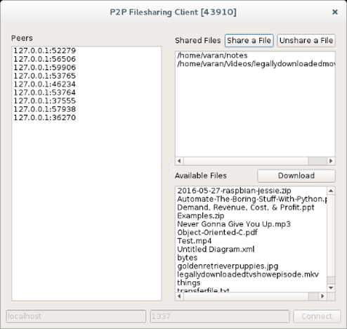
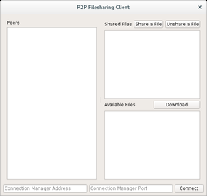

# P2P-File-Transfer-Client

An application that uses peer-to-peer architecture to transfer files among peers on the network. Simply for learning purposes.

 

# Dependencies

[Qt Framework](https://www.qt.io/download/ "Qt Framework") was used to implement the GUI and [Boost.Asio](http://www.boost.org/users/download/ "Boost.Asio") was used for sockets programming. Both are cross-platform and may be downloaded with little to no ease. Especially Boost.

# Installation

- Client: Simply open the `.pro` file in Qt Creator and build for minimum hassle.
- Connection Manager: `g++ -std=c++11 connectionmanager.cpp p2pnode.cpp -lboost_system -o connectionmanager`

# Usage

1. Run the connection manager executable (`./connectionmanager` on Linux).
2. Run the client(s).

